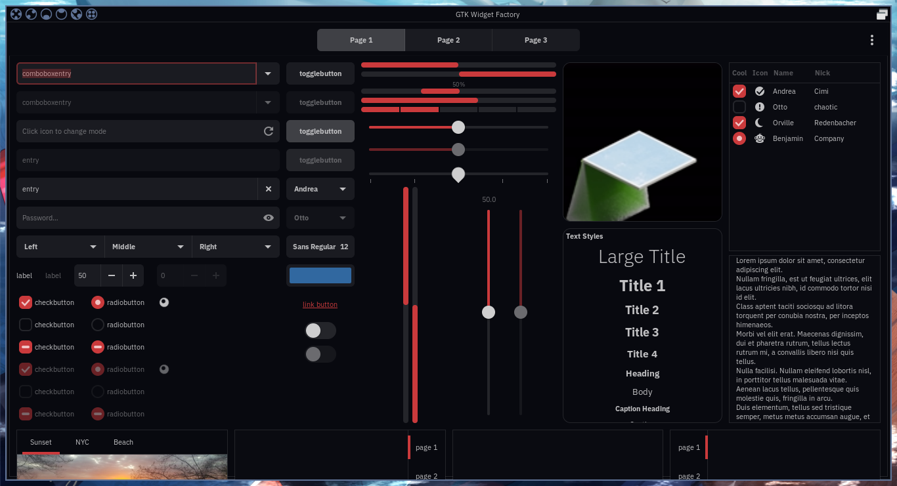
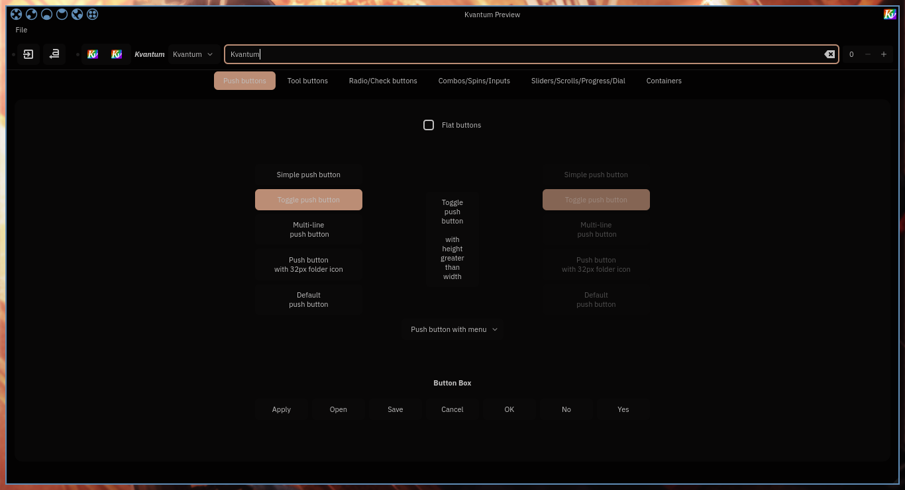
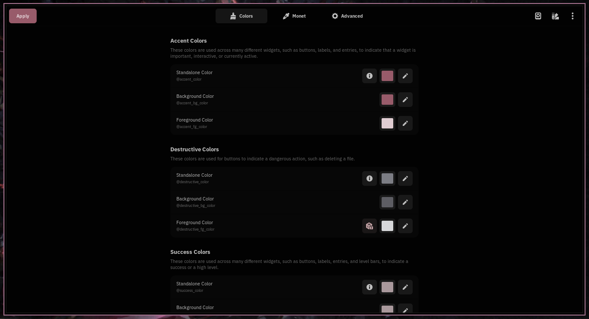
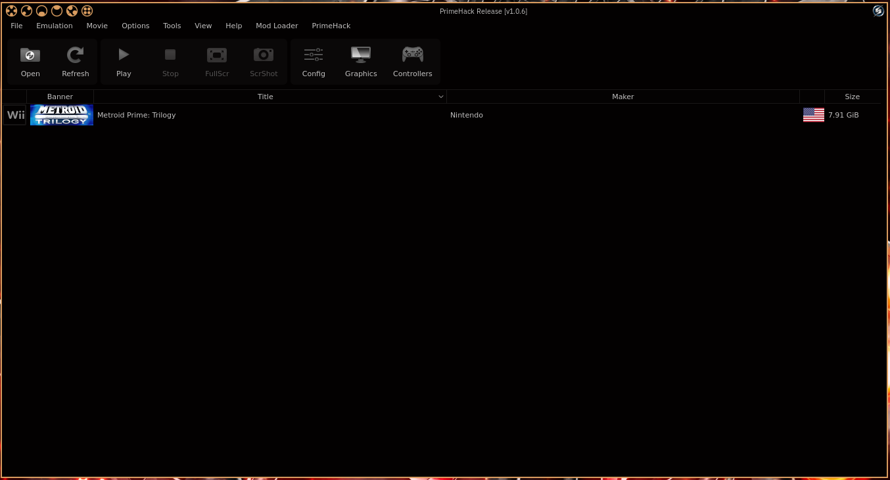

# Colorizing GTK and QT with pywal













# How to use

this repo contains 3 templates for use with pywal16:  
- pywal.json: template for the gradience theme   
- pywal.kvconfig: template for the kvconfig part of the kvantum theme   
- pywal.svg: template for the svg component of the kvantum theme   


after installing pywal16 and the desired backends, copy the templates into the user template
directory `"${HOME}"/.config/wal/templates/` run the wal command to generate or use your desired theme

then copy the built templates to the corresponding directories like this:
```sh
cp -f "${HOME}"/.cache/wal/pywal.json "${HOME}"/.var/app/com.github.GradienceTeam.Gradience/config/presets/user/pywal.json

mkdir -p "${HOME}"/.config/Kvantum/pywa
cp "${HOME}"/.cache/wal/pywal.kvconfig "${HOME}"/.config/Kvantum/pywal/pywal.kvconfig
cp "${HOME}"/.cache/wal/pywal.svg "${HOME}"/.config/Kvantum/pywal/pywal.svg
```

